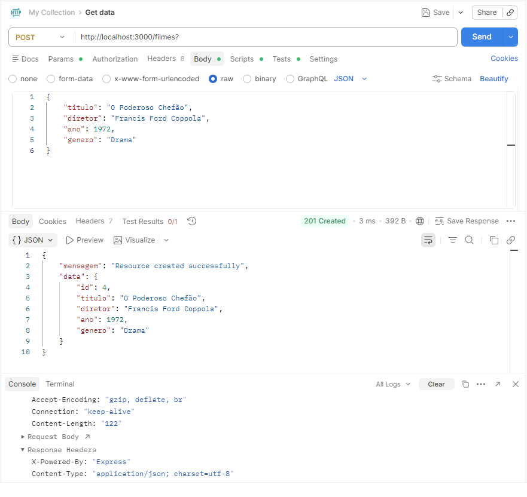
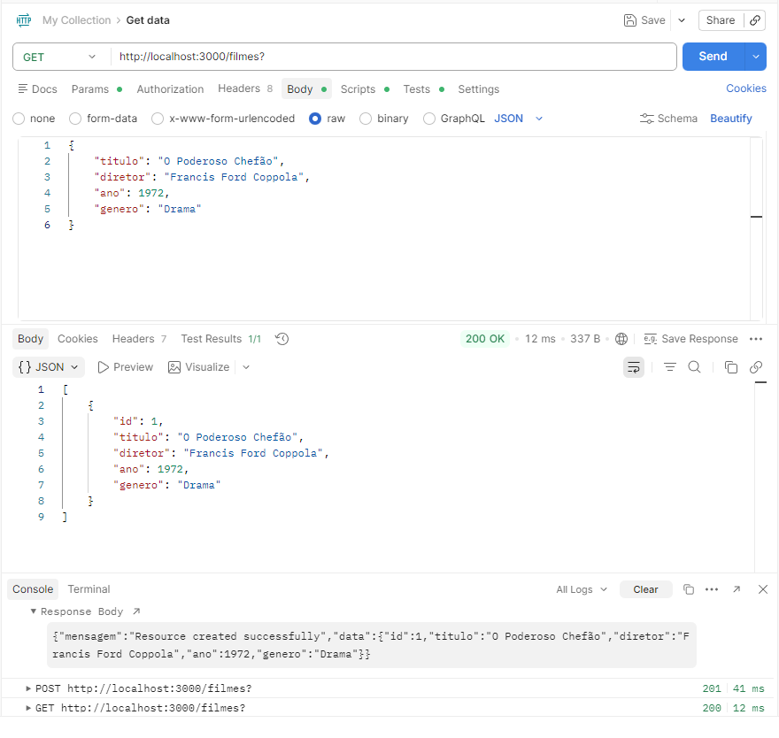
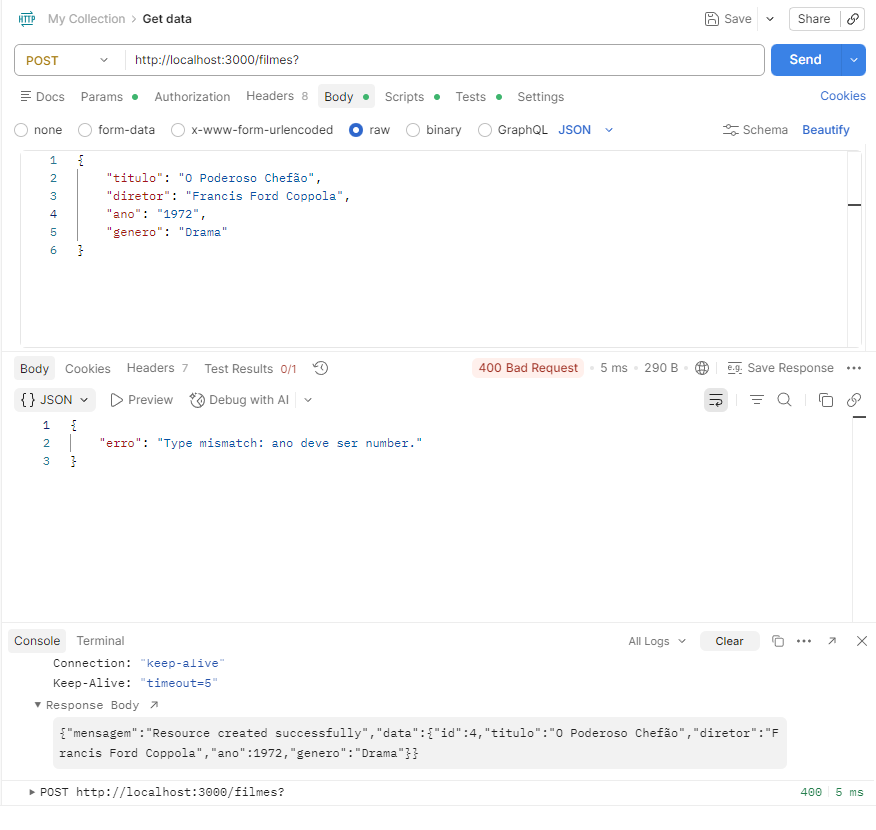

# 🎬 API REST de Filmes

Esta é uma API RESTful simples desenvolvida em Node.js com Express para o gerenciamento de um catálogo de filmes em memória (Mock DB). O projeto foi criado como parte da entrega de um trabalho acadêmico/curso, focando na implementação de rotas HTTP e validações rigorosas de dados.

---

## 🚀 Como executar o projeto

1. Certifique-se de ter o [Node.js](https://nodejs.org/) instalado.
2. Clone ou baixe este repositório.
3. Instale as dependências executando:
   ```bash
   npm install express
   ```
4. Inicie o servidor:
   ```bash
   node index.js
   ```
5. A API estará rodando em: `http://localhost:3000`

---

## 📌 Documentação dos Endpoints

Abaixo estão detalhados todos os endpoints disponíveis nesta API.

### 1. Listar Filmes
* **Método:** `GET`
* **URL:** `/filmes`
* **Descrição:** Retorna a lista de todos os filmes cadastrados no banco de dados em memória.
* **Body da Requisição:** *(Vazio)*
* **Resposta de Sucesso (200 OK):**
  ```json
  [
      {
          "id": 1,
          "titulo": "O Poderoso Chefão",
          "diretor": "Francis Ford Coppola",
          "ano": 1972,
          "genero": "Drama/Crime"
      }
  ]
  ```

### 2. Cadastrar Filme
* **Método:** `POST`
* **URL:** `/filmes`
* **Descrição:** Cria um novo registro de filme. Requer um payload JSON com os dados do filme e passa por um sistema de validação antes de salvar.
* **Body da Requisição (JSON):**
  ```json
  {
      "titulo": "Matrix",
      "diretor": "Lana Wachowski, Lilly Wachowski",
      "ano": 1999,
      "genero": "Ficção Científica"
  }
  ```
* **Resposta de Sucesso (201 Created):**
  ```json
  {
      "mensagem": "Resource created successfully",
      "data": {
          "id": 2,
          "titulo": "Matrix",
          "diretor": "Lana Wachowski, Lilly Wachowski",
          "ano": 1999,
          "genero": "Ficção Científica"
      }
  }
  ```
* **Respostas de Erro (400 Bad Request):** Retornadas caso as validações falhem (veja a seção de validações abaixo).

### 3. Atualizar Filme Integralmente
* **Método:** `PUT`
* **URL:** `/filmes/:id`
* **Descrição:** Atualiza todos os dados de um filme existente baseado no `id` passado na URL. Passa pelas mesmas validações de payload do método POST.
* **Body da Requisição (JSON):**
  ```json
  {
      "titulo": "Matrix Reloaded",
      "diretor": "Lana Wachowski, Lilly Wachowski",
      "ano": 2003,
      "genero": "Ficção Científica/Ação"
  }
  ```
* **Resposta de Sucesso (200 OK):**
  ```json
  {
      "mensagem": "Resource updated successfully",
      "data": {
          "id": 2,
          "titulo": "Matrix Reloaded",
          "diretor": "Lana Wachowski, Lilly Wachowski",
          "ano": 2003,
          "genero": "Ficção Científica/Ação"
      }
  }
  ```
* **Respostas de Erro:** `404 Not Found` (caso o ID não exista) ou `400 Bad Request` (caso as validações de payload falhem).

### 4. Deletar Filme
* **Método:** `DELETE`
* **URL:** `/filmes/:id`
* **Descrição:** Remove um filme específico do banco de dados em memória baseado no `id` passado na URL.
* **Body da Requisição:** *(Vazio)*
* **Resposta de Sucesso (200 OK):**
  ```json
  {
      "mensagem": "Resource deleted successfully"
  }
  ```
* **Respostas de Erro:** `404 Not Found` (caso o ID passado não exista no banco).

---

## 🛡️ Validações Implementadas

Os endpoints `POST` e `PUT` possuem uma camada de validação defensiva para garantir a integridade dos dados inseridos:

1. **Verificação de Existência (Not Found):** No `PUT` e `DELETE`, a API verifica primeiro se o `id` informado pertence a um registro válido. Se não, retorna `404`.
2. **Campos Obrigatórios (Missing Fields):** A API verifica se o payload contém as quatro propriedades fundamentais: `titulo`, `diretor`, `ano` e `genero`. Caso falte alguma, a requisição é rejeitada (`400`).
3. **Checagem de Tipos (Type Checking):** * Impede que números sejam enviados em campos de texto. `titulo`, `diretor` e `genero` **devem** ser obrigatoriamente do tipo `string`.
   * Impede que o ano seja enviado como texto (ex: "1999"). O campo `ano` **deve** ser obrigatoriamente do tipo `number`.
4. **Regra de Negócio (Business Rule):** O campo `ano` passa por uma validação de coerência histórica. Como o cinema surgiu no final do século XIX, o ano não pode ser menor que `1888`. Além disso, para evitar typos, o ano não pode ser maior do que 5 anos a partir do ano atual.

---

## 🧪 Exemplos e Testes no Postman

Para validar a aplicação, foram realizados testes no Postman utilizando a Collection salva no repositório.

### Teste 1: Cadastro com Sucesso (POST)
Enviando um payload válido para criar um recurso.
> **Screenshot do Teste:**
> 

### Teste 2: Listagem de Filmes (GET)
Verificando se os recursos criados via POST estão sendo listados corretamente no GET.
> **Screenshot do Teste:**
> 

### Teste 3: Validação de Erro - Tipo Incorreto (POST/PUT)
Enviando o "ano" como String em vez de Number para disparar o erro 400.
> **Screenshot do Teste:**
> 

### Teste 4: Atualização de Filme (PUT)
Atualizando as informações de um filme existente.
> **Screenshot do Teste:**
> 
> 

### Teste 5: Remoção de Filme (DELETE)
Deletando um recurso previamente criado.
> **Screenshot do Teste:**
> 